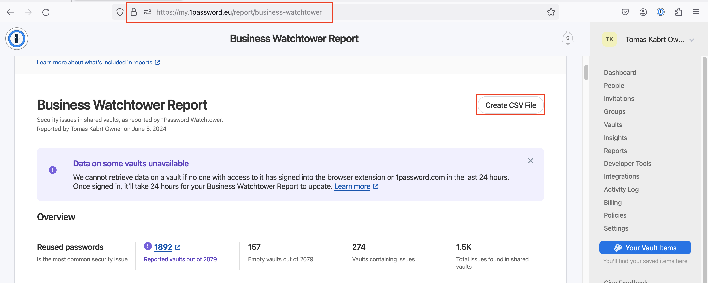
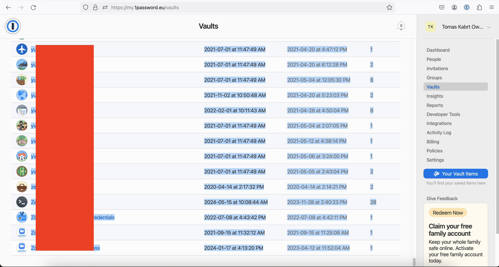
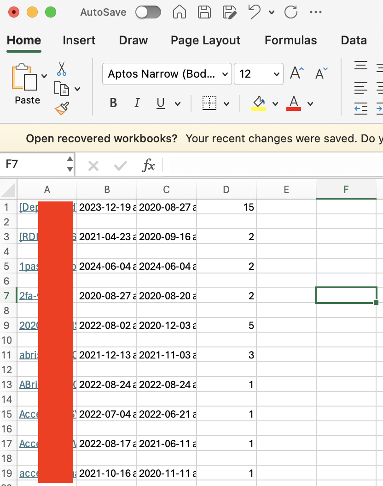
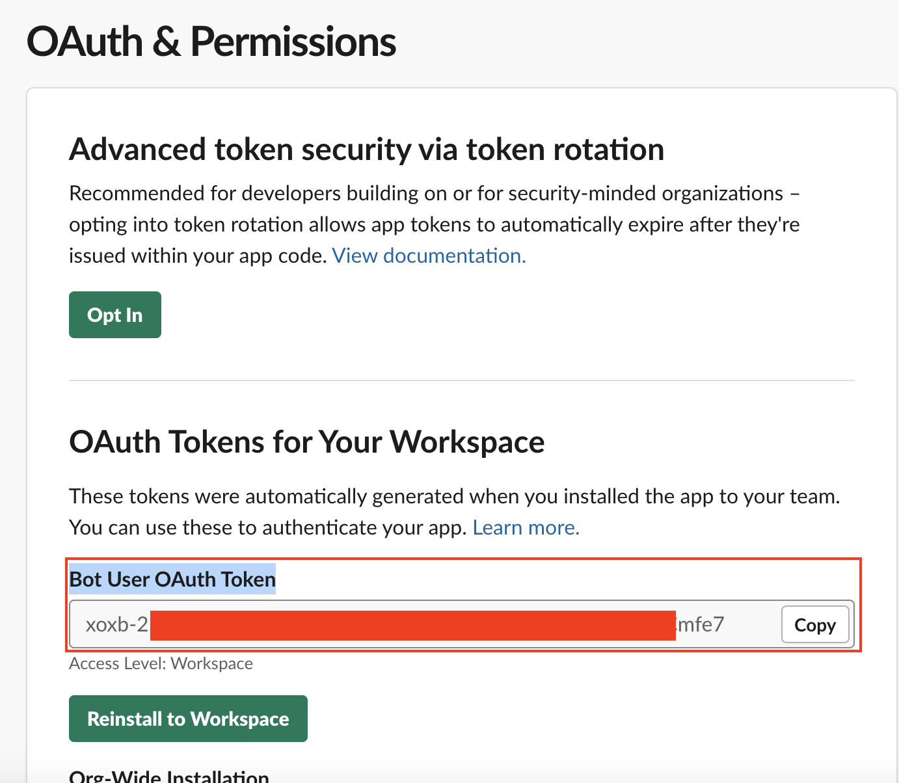
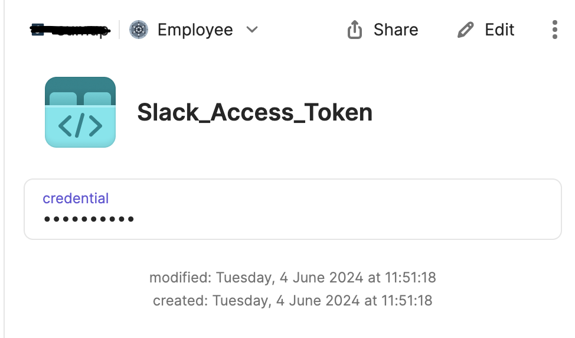
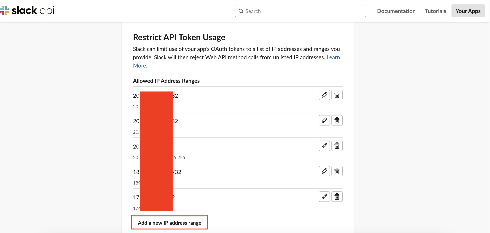
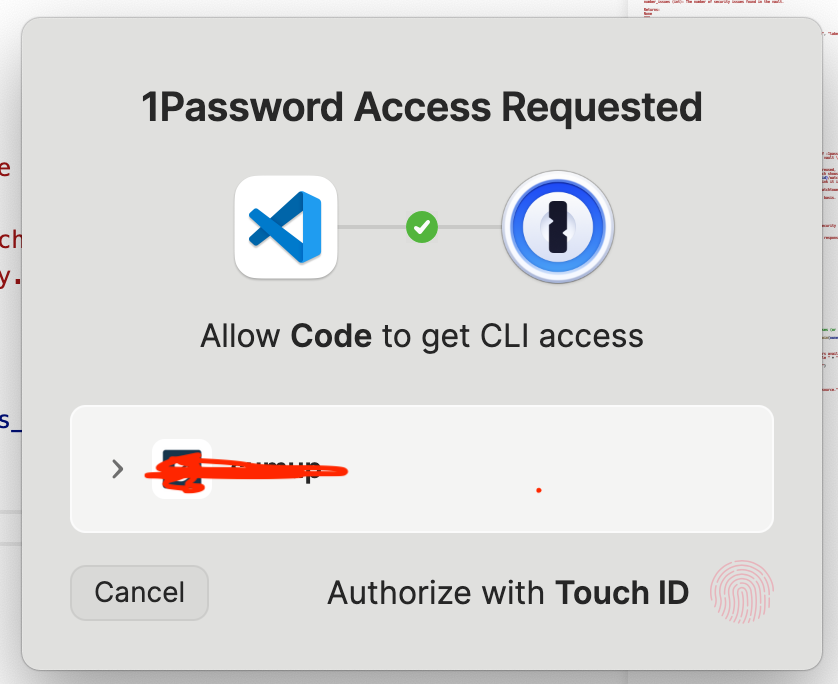
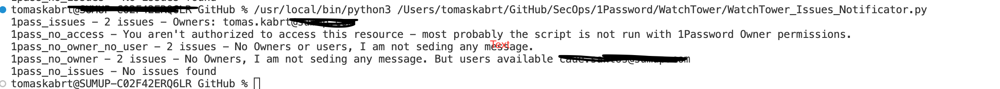
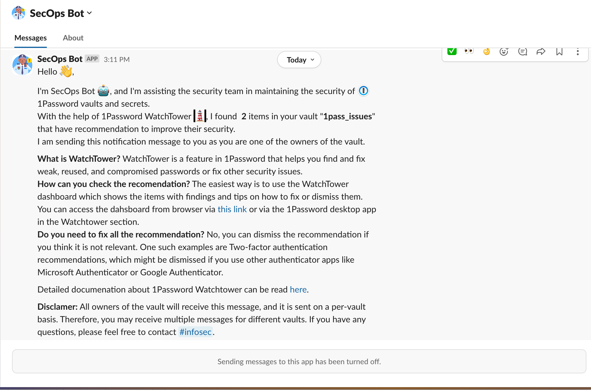
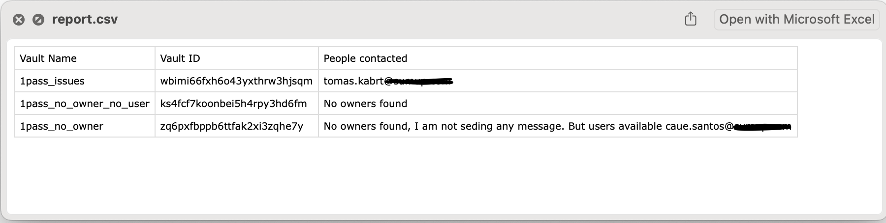

# 1Password WatchTower Notificator

One of our Q2 2024 OKRs was to improve the health state of 1Password secrets. This can be achieved and measured through a feature called 1Password WatchTower Business. This feature can check secrets in shared vaults (it cannot check Private (now called Employee) vaults). https://support.1password.com/watchtower/

The report is visible for admin users with necessary permissions under `Reports->Business Watchtower`. However, the results from Watchtower are not accessible via API/CLI at this moment (1Password support has been contacted and they have logged a feature request). Therefore, this script uses several tricks to gather the information we need and send notifications to the owners of the vaults with identified issues. The usage can be a little challenging, but the steps are described in detail below.

## Preparation

### Export 1Password WatchTower report

The script expects the 1Password WatchTower report as a CSV file that can be exported from the 1Password Admin Dashboard.

1. Go to https://my.1password.eu/report/business-watchtower

2. Save it as `watchtower_report.csv` in the same folder as `WatchTower_Issues_Notificator.py`

### Export all the vault names from 1Password

To make the connection between the vault name from the WatchTower report, we need a report of all vaults with names and links to them as they contain vault IDs. These IDs are later used to find the owners of the vaults.

1. Go to https://my.1password.eu/vaults
2. Select everything in the vault section and copy it to the clipboard

3. Open a Microsoft Excel file and paste the clipboard content into the file. The names of the vaults need to be in the first column and they need to be hyperlinks that contain links to 1Password.

    

4. Save it as `1password_vault_export.xlsx` in the same folder as `WatchTower_Issues_Notificator.py`

### Obtain Slack Bot secret

The notification messages are sent to the vault owners via Slack. For this, you need to save the secret into your 1Password account.

1. Open Settings for SecOps Slack Bot at https://api.slack.com/apps/A042A5NAVFY/oauth
2. Copy the `Bot User OAuth Token` and create a new secret as API credential in your 1Password account.

    

3. The name of the credential should match the one set up via the `slack_access_token_cred_name` variable.

    

4. In the SecOps Slack Bot settings, scroll down to `Restrict API Token Usage` and add the IP address from which you plan to run the script. The SecOps Slack Bot restricts the IP addresses that can use the OAuth Token. Please remove your IP after the script has run.

### 1Password Desktop App with CLI

The script uses the 1Password CLI to query 1Password for vault metadata. For this, you need to have it installed and set up. For installation steps, please follow https://developer.1password.com/docs/cli/get-started/

Additionally, you will want to authenticate with your Owner's account to the 1Password desktop app, so the 1Password CLI is called with high privilege as half of the vaults are accessible only to owners. If you run the script with a plain admin account, it will contact the vaults it can get the owner information for, and the rest will be skipped.

## Usage

Now, you should be ready to run the script (on MacOS - the script wasn't tested on Windows and I suspect there may be issues with running the 1Password CLI on it). The execution is straightforward, just prepare all the files above, validate the settings of the variables at the beginning of the script, and execute.

You will be prompted to allow access of the script to your 1Password.

    

And in the terminal, you can see the progress of the script and results for the vaults from the `watchtower_report.csv` file.

    

The output of the script can have the following states for the vaults in the 1Password Watchtower report:

`1pass_issues - 2 issues - Owners: tomas.kabrt@sumup.com`

The vault has issues and there is at least one owner who will receive a notification.

`1pass_no_owner - 2 issues - No Owners, I am not sending any message. But users available caue.santos@sumup.com`

The vault has issues and there is no owner, but there is a user. The user is not notified.

`1pass_no_owner_no_user - 2 issues - No Owners or users, I am not sending any message.`

The vault has issues and there is no owner or user.

`1pass_no_access - You aren't authorized to access this resource - most probably the script is not run with 1Password Owner permissions.`

The vault is accessible only to Owners and you ran the script with CLI access not as an Owner.

`1pass_no_issues - No issues found`

The vault has no issue identified by WatchTower. Skipping this vault.

`1pass_issues - Multiple vaults found with this name, cannot determine which is the correct one, skipping.`

There are more vaults with the same name in the tenant - the script cannot determine the correct vault id and hence cannot send the notification. This cases needs to be handeled by hand.

### Notification message

If the owner(s) of the vault are identified, the SecOps Slack bot sends them a message with the name of the vault, the number of items with issues, and how to fix them.

    

### Report

The script also creates a file `report.csv` in the same folder as the script. This file contains information about the vaults that were checked. The column "People contacted" shows the people that were contacted via Slack.

    

